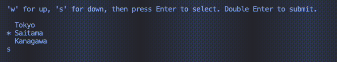
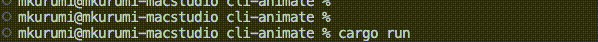

# cli-animate

`cli-animate` is a Rust crate designed to **enrich command-line applications with a variety of beautiful, easy-to-use animations**.
It offers a straightforward way to integrate visual elements such as progress bars, interactive menus, and more, enhancing the interactivity of your CLIs.

## Features

**Progress Bars**: Show task progress with customizable, animated progress bars. \
**Interactive Menus**: Navigate through options with intuitive, keyboard-navigable menus. \
**Loading Indicators**: Display a loading indicator to show that your application is working. \
**Styles Customizable**: Customize the look of your animations with colors and characters. \
**And More**: The library is designed for extensibility and includes a variety of other tools to enrich your CLI applications.

## Installation

Add `cli-animate` to your `Cargo.toml` file's dependencies section:

```
[dependencies]
cli-animate = "0.1.0"
```

## Example

**Interactive Menu**:



```rust
use cli_animate::InteractiveMenu;

fn main() {
    let options = vec![
        "Tokyo".to_string(),
        "Saitama".to_string(),
        "Kanagawa".to_string(),
    ];

    let mut menu = InteractiveMenu::new(options.clone());

    // Run it!
    let selected_index = menu.run().unwrap(); // Returns the index of the user's selected option.

    println!("You selected: {}", options[selected_index]); // "You selected: Tokyo"
}
```

**Progress Bar**:



```rust
use cli_animate::{ProgressBar, StyleBuilder, Color};

fn main() {
    let progress_value = Arc::new(Mutex::new(0));

    // Create a clone of the progress_value for the other thread.
    let thread_progress_value = progress_value.clone();

    // Some work done in another thread.
    let do_some_work = thread::spawn(move || {
        let mut num = 0;
        while num <= 100 {
            thread::sleep(time::Duration::from_millis(20));

            let mut val = thread_progress_value.lock().unwrap(); // Update the progress value.
            *val = num;

            num += 1;
        }
    });

    // Initialize a progress bar.
    let style = StyleBuilder::new() // Customize the progress bar's style!
        .color(Color::Green)
        .bar_length(20)
        .build();
    let progress_bar = ProgressBar::new(0, 100, move || *progress_value.lock().unwrap(), style);

    let mut writer = std::io::stdout();

    // Start it!
    progress_bar.start(&mut writer);
    
    // Wait for the worker thread to finish.
    do_some_work.join().unwrap();
}

```

Check out the `examples/` directory in the repository for more usage examples of cli-animate.

## License
This project is licensed under the MIT License - see the LICENSE file for details.

Thank you for using `cli-animate` to make your command-line applications more attractive and engaging!
